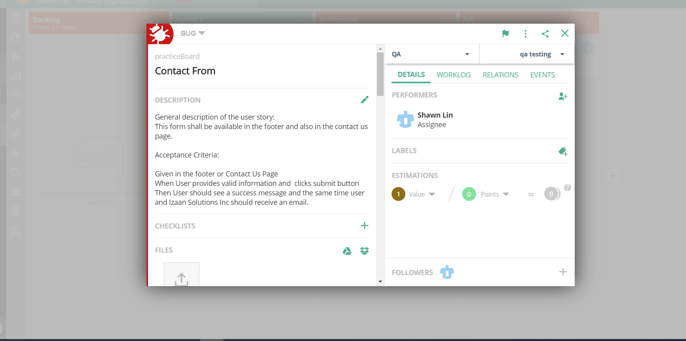
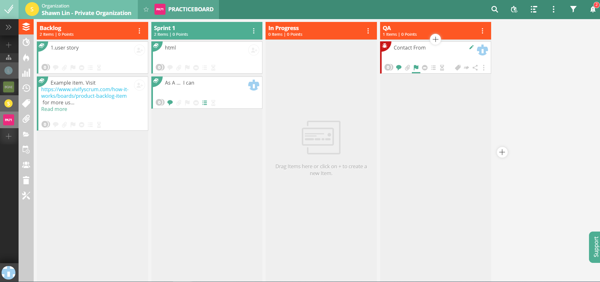

#  Module01-Test
## [Click To see Description For test](https://github.com/Jahidul2543/QAAE-Module01-Test/blob/master/QAAE-Module-01.pdf)


## Test Report
[Click Me](./Test%20Plan.xlsx)

## Pictures of Scrum Board 



## SQL With Output
[click Me](./sql.md)

## Deployed Web IP 
(http://52.15.70.223/)[http://52.15.70.223/] 
## Picture  For HackerRank


## Postgres  exercise 


  ```postgresql
SELECT starttime FROM cd.members AS m INNER JOIN cd.bookings AS b USING(memid) where 
m.firstname = 'David' AND m.surname = 'Farrell';
  ```

---

```postgresql
 SElECT starttime AS start , f.name FROM cd.bookings AS b INNER JOIN cd.facilities AS f 
 USING(facid) 
 WHERE
starttime >= '2012-09-21' AND
		starttime < '2012-09-22'
		AND f.name LIKE '%Tennis Court%'
ORDER BY starttime;     
```
---
```postgresql
SELECT DISTINCT  m.firstname,m.surname FROM cd.members AS m  INNER JOIN cd.members AS m2
on m.memid = m2.recommendedby
ORDER BY surname,firstname;
```
--
```postgresql
SELECT   m.firstname AS memfname,m.surname AS memsname,
m2.firstname AS recfname, m2.surname AS recsname
FROM 
cd.members AS m LEFT  JOIN  cd.members AS m2
on m2.memid = m.recommendedby

ORDER BY  memsname, memfname;
```


---
```postgresql
SELECT DISTINCT CONCAt(m.firstname, ' ', m.surname) AS member,
	(SELECT  CONCAt(m2.firstname, ' ', m2.surname) AS recommender 
		FROM cd.members AS m2 
		WHERE m2.memid = m.recommendedby
	)
	FROM 
		cd.members m
ORDER BY member; 
```
---
```postgresql
SELECT DISTINCT CONCAT(m.firstname,' ', m.surname) AS member, f.name AS	facility

FROM cd.members AS m  INNER JOIN cd.bookings AS b USING(memid)
INNER JOIN cd.facilities AS f USING(facid)
WHERE  f.name LIKE '%Tennis Court%'

```
---
```postgresql
SELECT  CONCAT( m.firstname, ' ', m.surname ) AS member, 
	f.name AS facility, 
	CASE 
		WHEN m.memid = 0 THEN 
			b.slots * f.guestcost
		ELSE 
			b.slots* f.membercost
	END 
AS cost
        FROM 
                cd.members m                
              INNER JOIN  
			  cd.bookings AS b USING(memid)
              INNER JOIN cd.facilities AS f
                       USING(facid)
        WHERE
		b.starttime >= '2012-09-14' AND 
		b.starttime < '2012-09-15' AND (
			(m.memid = 0 and b.slots*f.guestcost > 30) OR 
			(m.memid != 0 and b.slots*f.membercost > 30)
		)
ORDER BY cost DESC ;   
```
